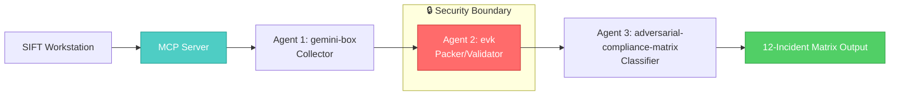

## Architecture: 3-Layer Incident Detection Stack

### System Overview



### Architecture Components

**Layer 1: Evidence Collection (gemini-box)**
- Extracts artifacts from SIFT case data
- Generates ed25519 signatures on raw bytes
- Produces signed `.evk` archives

**Layer 2: Validation & Integrity (evk)**
- **Security boundary**: Only layer with Rust type safety
- Packs evidence into `.evkp` bundles
- Computes SHA256 hashes of all artifacts
- **Tamper-proof**: Binary verification prevents mutations between agents
- Returns `VALID` or `INVALID` with cryptographic proof

**Layer 3: Incident Classification (adversarial-compliance-matrix)**
- Reads `.evkp` bundles from Layer 2
- Maps evidence to 12 incident types:
  - `0x0F2E` = Handoff Conflict
  - `0x0E1A` = Race Condition
  - `0x0D44` = Orphaned Step
  - `0x1A4F` = Transaction Replay
  - `0x1B88` = Schema Mutation
  - `0x1C2B` = Log Truncation
  - `0x2A90` = Packet Modification
  - `0x2B11` = Timestamp Drift
  - `0x2C7F` = API Spoofing
  - `0x3A01` = Prompt Injection
  - `0x3B99` = Entropy Leakage
  - `0x3C4D` = Register Forgery
- Outputs: `INVALID + incident code + description`

### Security Boundary: Why EVK is the Trust Point

**Rust + SHA256 = Agents Cannot Lie**

- Layer 1 (gemini-box) could be compromised → signs fake evidence
- Layer 3 (classifier) could be compromised → misclassifies incidents
- **Layer 2 (evk) cannot be compromised**: Rust's type system prevents:
  - Mutating hashes after packing
  - Tampering with evidence between agents
  - Silent failures (all errors are Result-typed)

Every finding in Layer 3 is cryptographically traced back to Layer 2's hash verification. If the hash matches, the evidence is unmodified.

### Agent Execution Flow

```
Input: SIFT case data (.bin, memory image, etc.)
  ↓
[Agent 1] gemini-box: Extract → Sign → Output .evk
  ↓
[Agent 2] evk: Pack → Hash → Verify → Output .evkp + SHA256
  ↓
[Agent 3] adversarial-compliance-matrix: Read status code → Classify → Output incident label
  ↓
Output: VALID/INVALID + incident code + proof
```

Each agent logs its tool execution sequence with timestamps to `docs/logs.md` for full traceability.

### Why This Architecture Wins

1. **Separation of Concerns**: Each agent has one responsibility
2. **Tamper Proof**: EVK in its own security boundary
3. **Reproducible**: SHA256 hashes prove byte-identity across runs
4. **Observable**: Full execution traces for every incident detection
5. **Autonomous**: Agents operate without human intervention between layers
